# Pehchaan architecture

> पहचान · identity. Identity and eligibility verification that plugs into Hackingly's existing Textract pipeline and returns a decision, a confidence score and a plain-language reason for every registration.

Research behind these choices: [RESEARCH.md](RESEARCH.md). Threat model: [SECURITY.md](SECURITY.md). Build order: [BUILD_PLAN.md](BUILD_PLAN.md).

## 1. Thesis

**Trust what can't be faked.** Generative models now produce convincing Aadhaar and PAN replicas, and published benchmarks put vision-model forgery judges at chance on AI-edited documents. So Pehchaan never lets pixels decide. It ranks evidence:

| Trust | Evidence | Can it reject someone? |
|---|---|---|
| 1. Signed | Aadhaar Secure QR signature (UIDAI RSA-2048); in production DigiLocker and Aadhaar App credentials | Yes, when signed data contradicts the card or the event rules |
| 2. Consistent | Form ↔ OCR ↔ QR ↔ face ↔ college email ↔ institution registry | Only an age outside the window with a confirmed DOB |
| 3. Seen before | Same ID, image or face under another identity, across every Hackingly event | Never. Sends both cases to review |
| 4. Pixels | Screen recapture, local edit traces, editing-software metadata | Never. Review or retake only |

And one product rule: **a genuine student is never rejected by an uncertain signal.** Uncertainty turns into a one-tap fix for the participant, or a review for the organiser.

## 2. Evidence ladder

Each registration climbs as high as its evidence allows. Levels are cumulative.

| Level | Name | Reached when |
|---|---|---|
| L0 | Unusable | Image fails the quality gate (blur, glare, no card, cropped). Participant retakes; nobody is rejected |
| L1 | Read | Document type identified; name, DOB and ID number extracted |
| L2 | Consistent | Number format/checksum valid, fields agree with the form, no duplicate conflict, no edit signal |
| L3 | Proven | An authoritative signature confirms the document and its data matches the printed card |
| L4 | Present | A live selfie (passes anti-spoofing) matches the proven photo |

`auto_verify_min_level` is set per event (default L2). A selfie match below L3 raises confidence but does not change the level.

## 3. Decisions

| Decision | When | Participant sees |
|---|---|---|
| `verified` | No blocking reason and level ≥ event minimum | Registration confirmed |
| `action_required` | Something the participant can fix: retake a blurry photo, photograph the card instead of a screen, upload a college ID for a student-only event, retake a selfie | The exact fix, one tap away |
| `needs_review` | Any uncertain signal: partial name match, possible edit, duplicate conflict, check error, DOB only readable with low confidence | "We're checking your ID; you'll hear back soon." |
| `not_eligible` | **Hard evidence only**: DOB outside the age window from a signed QR or a confident OCR read that also matches the form; printed data contradicting a valid signed QR | The specific reason and how to appeal |

Flags travel alongside the decision: `minor` and `guardian_consent_required` (under 18 on the event date), `duplicate_suspected`.

Precedence: `not_eligible` > `action_required` > `needs_review` > `verified`. A check that crashes produces `needs_review`, never a rejection.

**Confidence** is the probability that the decision matches what an expert reviewer would decide. For the demo it is a transparent heuristic: a base per level, minus penalties per warning. In production it is calibrated with isotonic regression on reviewer outcomes, which every review generates for free.

**Reasons** are machine codes (`AGE_BELOW_MIN_CONFIRMED`, `NAME_PARTIAL_MATCH`, …) rendered from templates (English now, Hindi next). No sentence is free-generated, so every reason is true. The catalog lives in [`api/src/pehchaan/domain/reasons.py`](../api/src/pehchaan/domain/reasons.py).

## 4. System view

```mermaid
flowchart LR
  subgraph P[Participant device]
    CAP[Capture page<br/>on-device blur · glare · face guidance]
  end
  subgraph H[Hackingly · existing]
    REG[Registration flow]
    TX[Textract DOB pipeline<br/>unchanged]
  end
  subgraph S[Pehchaan service]
    API[POST /v1/verifications<br/>idempotent on registration_id]
    Q[Quality gate]
    EX[Extract<br/>reuse Textract JSON · Queries when missing]
    subgraph C[Checks in parallel]
      DR[Document rules]
      QR[Aadhaar QR proof]
      TM[Edit & recapture signals]
      DU[Duplicate graph]
      ID[Identity match]
    end
    EL[Eligibility<br/>age on event date · student status]
    LED[(Evidence ledger)]
    DEC[Decision engine<br/>versioned event policy]
  end
  subgraph A[Act]
    WH[Signed webhook to Hackingly]
    CON[Organiser console<br/>review queue + AI copilot]
    AUD[(Hash-chained audit log)]
    GC[Guardian consent]
  end
  CAP --> REG --> TX
  REG -- form + image --> API
  TX -- Textract JSON --> API
  API --> Q --> EX --> C --> EL --> LED --> DEC
  DEC --> WH & CON & AUD
  DEC -- under 18 --> GC
  CON -- reviewer outcome --> AUD
```



### Pipeline stages

1. **Quality gate** (~250 ms). Laplacian-variance blur, saturated-pixel glare on the card region, card contour found, face present on the ID. The same checks run on-device first, so most retakes happen before upload.
2. **Extract.** Parse Hackingly's Textract response when supplied (no second OCR bill). If name, DOB, ID number, institution or validity are missing, call `AnalyzeDocument` with Queries. Classify the document type deterministically from anchor text ("INCOME TAX DEPARTMENT", "ELECTION COMMISSION OF INDIA", MRZ `P<IND`, Aadhaar number pattern). No vision model reads the document: Groq's production models are text-only, and a model that invents a plausible date is worse than a field left empty, which becomes a retake.
3. **Checks in parallel** (async, CPU work in a thread pool):
   - **Document rules.** Aadhaar Verhoeff checksum, PAN structure (4th char `P` for individuals; 5th char surname initial as a soft hint only, since initial-first South Indian names break it), EPIC and passport formats, passport MRZ check digits, date sanity, college ID validity on the event date.
   - **Aadhaar QR proof.** WeChat QR detector → big-integer decode → gzip → field split → **RSA/SHA-256 signature verified against the UIDAI certificate** → QR name/DOB/gender compared with printed OCR and form (year-of-birth-only cards handled) → QR photo compared with printed photo. QR data is used in memory and discarded.
   - **Edit and recapture signals.** Screen moiré via FFT peaks, noise/compression inconsistency inside the DOB and name boxes compared with the rest of the card, text-line geometry anomalies from Textract bounding boxes (a pasted DOB sits at a different height or angle), editing-software metadata. All soft, and the recapture signal is reported but disabled until calibrated on real photos.
   - **Duplicate graph.** Keyed HMAC of (document type, normalised number); PDQ hash of the card crop; SFace embedding of the ID face; email/phone/device velocity. Scope is **platform-wide**: the same person registering for many events is normal, the same ID or face under a different identity is a conflict.
   - **Identity match.** Form ↔ OCR ↔ QR names with `indic-namematch`; DOB; college email domain ↔ institution (AISHE registry); selfie ↔ ID/QR photo with SFace after MiniFASNet anti-spoofing.
4. **Eligibility.** Age on the **event date** (not the registration date). DOB strength decides whether an out-of-range age is a hard reason or a review. Student-only events need student evidence; an Aadhaar alone proves age, not enrolment, so it produces `action_required: upload_college_id`.
5. **Decision engine.** Pure function of (evidence ledger, event policy, reason catalog), so it is deterministic, unit-tested and replayable. The policy version is stored with every decision.

## 5. Where AI is used, and where it isn't

| AI component | Job | Guardrail |
|---|---|---|
| Textract (managed OCR) | Read printed fields | Per-field confidence feeds reason strength |
| Vision model, grounded extraction | Structure unfamiliar college IDs | Values must exist in OCR tokens |
| YuNet + SFace | Find and compare faces (ID ↔ QR photo ↔ selfie ↔ other registrations) | Thresholds tuned on the eval set; mismatch → review |
| MiniFASNet | Detect printed-photo or screen selfies | Spoof → retake, not reject |
| PDQ perceptual hash | Spot the same image re-used | Match → review |
| Name model (`indic-namematch`) | Match names across scripts, initials and orderings | Score bands, never hard fail |
| Reviewer copilot (LLM) | One-paragraph case summary citing check IDs, suggested next step | Read-only; input is the ledger, not raw PII; cannot approve or reject |
| Vision model, tamper second opinion | Flag odd regions for a human | Soft signal only |

**Rules decide. AI gathers the evidence and explains it.** That split is what lets us promise both low false positives and a true reason for every decision.

## 6. Integration with Hackingly

The whole change to Hackingly's flow is one call after the existing Textract step. Their DOB check keeps running.

```http
POST /v1/verifications
X-API-Key: <tenant key>
Idempotency-Key: <registration_id>
Content-Type: multipart/form-data

payload      {"registration_id","event_id","form":{name,dob,email,institution},"textract_response":{...}}
id_image     <file>                  (JPEG/PNG/PDF e-Aadhaar)
selfie       <file, optional>
```

```json
{
  "verification_id": "ver_01J8Z…",
  "registration_id": "reg_4411",
  "event_id": "evt_blr_ai_build",
  "decision": "needs_review",
  "confidence": 0.62,
  "evidence_level": 2,
  "reasons": [
    {"code": "TAMPER_SUSPECTED_FIELD", "effect": "review", "check": "tamper",
     "message": "Possible edit in the date of birth area"}
  ],
  "actions": [],
  "flags": {"minor": false, "guardian_consent_required": false, "duplicate_suspected": false},
  "document": {"type": "aadhaar", "id_last4": "4821", "age_on_event_date": 20},
  "policy_version": "evt_blr_ai_build@3",
  "checks": [{"check": "aadhaar_qr", "status": "skipped",
              "findings": [{"code": "AADHAAR_QR_NOT_FOUND", "params": {}}], "duration_ms": 41, "details": {}}]
}
```

- **Sync by default** (target p95 < 3 s without Queries). Returns `202` plus an HMAC-signed webhook when a check needs longer.
- **Event policy** is set once per event: `PUT /v1/events/{id}/policy` with age window, student-only, accepted documents, selfie requirement, auto-verify level.
- **Shadow mode first.** Pehchaan runs alongside the current flow and only records decisions; Hackingly compares against its manual outcomes, then switches enforcement on per event. That is how false positives are measured before a single student is affected.
- **Verified once, trusted everywhere.** A participant verified at L3+ gets a signed Pehchaan pass bound to their Hackingly account (expires, revocable), so future events skip re-verification. Less friction, lower cost, and a reason for organisers to host on Hackingly.

## 6b. Three ways evidence arrives

The pipeline above is the document path. Two more paths reach the same decision engine, the same reason codes and the same audit log.

| Path | How it works | Evidence level | What Pehchaan keeps |
|---|---|---|---|
| **Document** `POST /v1/verifications` | Photo or e-Aadhaar PDF through the full pipeline | Up to L4 | The image, only while a human is reviewing it |
| **Pehchaan Pass** `POST /v1/verifications/pass` | An ES256 token issued after a verified registration, bound to a keyed hash of the Hackingly account, carrying name, DOB, level and student validity. Re-checked against this event's rules. Expires in 12 months (or when the college ID does) and is revoked automatically if the verification behind it is later flagged | The level it was issued at | Nothing new; no OCR, no image |
| **Aadhaar App** `POST /v1/aadhaar-app/sessions` | OpenID4VP: the participant scans a QR, authenticates with their face in the app, and the app posts a UIDAI-signed SD-JWT. Pehchaan verifies the issuer signature, the disclosure digests and the holder key binding, and asks only for what the event needs (`ResidentName` + `AgeAbove18` for an 18+ event) | L4 when key-bound | Name and an age attestation. No DOB, no photo, no image |

The pass is also the cost story: a returning participant costs no OCR and a few milliseconds, so verification gets cheaper for Hackingly with every event, not more expensive.

## 6c. Tenants, roles and rollout

- Every event, verification, job and audit entry belongs to a **tenant** (Hackingly's platform, or an organiser). API keys are hashed at startup and carry a tenant and a role: `platform` (submit and read), `reviewer` (queue, images, copilot), `admin` (everything, including usage and erasure).
- The **duplicate graph spans tenants** because fraud does, but a conflict surfaces only as a flag: no detail about the other tenant's registration crosses the boundary.
- An event can run in **shadow mode**: decisions are recorded and returned with `enforced: false`, Hackingly reports what its own process decided (`POST /v1/verifications/{id}/outcome`), and `GET /v1/stats` shows agreement, false rejections and missed fraud before anyone is blocked.

## 7. Data model

| Table | Holds | Notes |
|---|---|---|
| `tenants` | Organiser orgs, API key hashes, webhook secret | Row-level tenancy on every table |
| `event_policies` | Versioned policy JSON per event | Decisions reference `event_id@version` |
| `verifications` | Decision, level, confidence, flags, reason codes | No raw ID numbers |
| `evidence` | One row per check: status, codes, scores, timings | The ledger shown in the console |
| `identity_keys` | `HMAC(pepper, doctype:number)` → first verification, masked last 4 | Pepper held in KMS |
| `face_index` | Encrypted SFace embeddings | Deleted with images |
| `image_hashes` | PDQ hashes of card crops | Not reversible to the image |
| `reviews` | Reviewer, action, reason, time | Labelled data for calibration |
| `audit_log` | `seq, prev_hash, hash, event` | Append-only, tamper-evident |

Images live in private object storage (S3 SSE-KMS, `ap-south-1`) with lifecycle deletion after the event plus a configurable window.

## 8. Scale and unit economics

- **Stateless API + worker pool.** The API does validation, the quality gate and orchestration; CPU-heavy checks run in workers behind a queue (SQS or Redis) that autoscale on depth. Registration deadlines are spiky; the queue absorbs them and the webhook path covers anything slower than the sync budget.
### Measured throughput (16-thread laptop, local OCR)

| In-flight verifications | Throughput | Median latency |
|---|---|---|
| 1 | 42/min | 1.2 s |
| 2 | 36/min | 3.1 s |
| 4 | 32/min | 6.9 s |
| 12 | 26/min | 20 s |

One verification already spreads across several cores (OCR and OpenCV are internally parallel), so the box tops
out near **40 verifications/minute** and extra concurrency buys latency, not throughput. Four uvicorn worker
processes measured the same as one, which rules out Python's GIL as the limit: it is the CPU.

That is what the bounded queue is for. Keep in-flight work small (1-2 per process), let the queue hold bursts,
and add machines for capacity. Registration deadlines are spiky, and a queue plus webhooks keeps latency
predictable instead of letting everything slow down at once. Reproduce with `scripts/loadtest.py`.

- **Cost per verification.** OCR is free if Hackingly's Textract response is reused; otherwise $0.0015 (DetectDocumentText) plus $0.015 only when Queries are needed (US list prices). CV models are small ONNX files on CPU. The LLM copilot runs only on review cases. Exact compute cost per verification comes from `eval/`, not guesses.
- **Cost falls over time.** Every verified pass removes a future verification; every review outcome improves calibration and reduces reviews.
- **Multi-tenant from day one**: per-tenant keys, policies, retention and webhooks.

## 9. Business case for Hackingly

1. **Organiser time.** Manual ID checks take minutes each; at a few thousand registrations per event that adds up to days. Pehchaan auto-verifies the clear cases and hands reviewers a pre-analysed queue.
2. **Sponsor trust.** Prize and swag fraud via multi-accounting is exactly what the duplicate graph catches. "Verified participants" is something sponsors pay for.
3. **Hiring partners.** A verified talent pool is worth more to the recruiters Hackingly already works with.
4. **Compliance ahead of May 2027.** Parental consent for minors and data minimisation are built in, not bolted on.
5. **Moat.** The cross-event graph and verified passes improve with every event and cannot be bought from a generic KYC vendor.

## 10. What we measure (and show the judges)

From one command in `eval/`:

- **False rejection rate** on genuine IDs (target: 0 hard rejections) and **genuine → review rate** (friction)
- **Auto-verify rate**
- **Catch rate per attack**: edited DOB, swapped photo, same ID under a new name, screen replay, AI-generated card, under-age, expired college ID, blurry
- p50/p95 latency per check and end to end; cost per verification

Dataset: clearly watermarked synthetic `SPECIMEN` cards, team members' own IDs with consent (never committed), Hackingly's anonymised samples.
